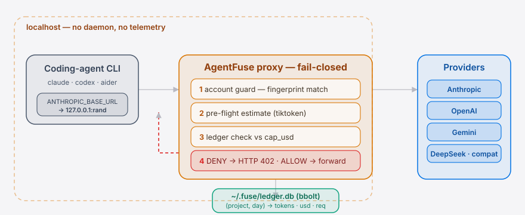

**English** | [简体中文](./README.zh-CN.md)

<p align="center">
  <a href="https://github.com/SuperMarioYL/agentfuse">
    
  </a>
</p>

<p align="center">
  <a href="LICENSE"></a>
  <a href="go.mod"></a>
  <a href="https://github.com/SuperMarioYL/agentfuse/releases"></a>
  <a href="CHANGELOG.md"></a>
  <a href="https://github.com/SuperMarioYL/agentfuse/actions/workflows/ci.yml"></a>
  <a href="#v020--multi-provider"></a>
</p>

<p align="center">
  
</p>

<p align="center"><em>A single Go binary that hard-caps what your <code>claude</code>, <code>codex</code>, or any coding-agent CLI is allowed to spend — per project, locally, with no daemon and no telemetry.</em></p>

---

## Table of contents

- [Why this exists](#why-this-exists)
- [Architecture](#-architecture)
- [Install &amp; quickstart](#install--quickstart)
- [Demo](#demo)
- [v0.2.0 — multi-provider](#v020--multi-provider)
- [Configuration](#configuration)
- [Commands](#commands)
- [How it works](#how-it-works)
- [Roadmap](#roadmap)
- [License &amp; contributing](#license--contributing)

---

## Why this exists

Coding-agent CLIs went from "press Enter for each turn" to overnight autonomous loops in under a year, and the billing model has not caught up. A single stray `.env` was enough to route **$187** of agent traffic to the wrong Anthropic account ([the PSA thread that started this repo, 476↑](https://reddit.com/r/ClaudeAI/comments/1tbaq2d/)). Overnight loops chew through Max-plan budgets. The June 15 `--print` reclassification flips scripts that ran for months from "subscription" to "credit-billed."

AgentFuse is the kill-switch that PSA asked for: a tiny local proxy that reads a `.fuse.toml` from your project root and **fails closed** the moment cumulative spend hits the cap. The next request never leaves your machine. No daemon. No cloud. Audit it with `strings` in thirty seconds.

##  Architecture

<p align="center">
  <picture>
    <source media="(prefers-color-scheme: dark)" srcset="./assets/atlas-dark.svg">
    <source media="(prefers-color-scheme: light)" srcset="./assets/atlas-light.svg">
    
  </picture>
</p>

`fuse run <cmd>` execs your coding-agent CLI as a child and rewrites its base URL to a random `127.0.0.1` port — the **AgentFuse proxy**. Every request passes four fail-closed gates: account guard (fingerprint match against `~/.fuse/accounts.toml`), a tiktoken pre-flight estimate, a ledger check against `cap_usd`, then **ALLOW → forward** to the configured provider or **DENY → HTTP 402**. Each reply's `usage` is written to the local bbolt ledger keyed by `(project, day)`. Nothing leaves the box except the upstream call you asked for.

## Install &amp; quickstart


```bash
# 1. install (Go 1.24+)
go install github.com/SuperMarioYL/agentfuse/cmd/fuse@latest

# 2. drop a $5 cap into your project
cd ~/code/myproj && fuse init

# 3. run your coding-agent CLI through the proxy
fuse run claude
```

<details>
<summary>Sample stdout when the cap fires</summary>

```text
$ fuse run claude
agentfuse: proxy on 127.0.0.1:54021 → api.anthropic.com (account=personal, cap=$5.00 project)
agentfuse: forwarding child stdio …

[claude session prints normally for a while …]

agentfuse: budget exceeded for project /Users/you/code/myproj ($5.02 / $5.00) — raise with: fuse cap +5
claude: API request denied (HTTP 402): budget exceeded. exiting.
```

```text
$ fuse status
project:    /Users/you/code/myproj
account:    personal
cap:        $5.00 (project window)

today:      $0.4317   (12 req, 145020 in / 9802 out tokens)
project:    $5.0231   (318 req)
remaining:  $0.0000   ✗ over cap — next request will be denied
```

</details>

##  Demo

<p align="center">
  
</p>

<sub>↑ Terminal recording, rendered in CI with <a href="https://github.com/charmbracelet/vhs">vhs</a> from <a href="./docs/demo.tape">docs/demo.tape</a> (regenerated on each release tag). It shows `fuse init` → `fuse run` → a runaway loop → the cap firing with HTTP 402 → `fuse cap +5` → resume.</sub>

## v0.2.0 — multi-provider


v0.1 shipped Anthropic + OpenAI. v0.2 broadens the same kill-switch — same binary, same `fuse run`, same `.fuse.toml` schema — to **five provider families**, and closes the "stream omits `usage`" hole by re-tokenizing locally with [tiktoken-go](https://github.com/pkoukk/tiktoken-go).

| Provider          | `provider = "..."` in `.fuse.toml` | Wire format                          | Usage source                                     |
| ----------------- | ---------------------------------- | ------------------------------------ | ------------------------------------------------ |
| Anthropic         | `"anthropic"` (default)            | Messages API + native SSE `usage`    | Upstream `usage` block                           |
| OpenAI            | `"openai"`                         | Chat Completions + `include_usage`   | Upstream `usage` block                           |
| Google Gemini     | `"gemini"`                         | `:generateContent` / `:stream…`      | `usageMetadata` → tiktoken fallback              |
| DeepSeek          | `"deepseek"`                       | OpenAI-compat shape                  | Final SSE `usage` (always, even w/o opt-in)      |
| OpenAI-compat     | `"openai_compat"` + `upstream_url` | Chat Completions on any host         | Upstream `usage` if present, else **tiktoken**   |

Example: route a project through Groq's Llama-3.1 with a $5 cap.

```toml
# .fuse.toml
cap_usd      = 5.0
provider     = "openai_compat"
upstream_url = "https://api.groq.com/openai/v1"
account      = "personal"
```

```bash
fuse run aider --model llama-3.1-70b
# fuse: proxy on 127.0.0.1:51234 — provider=openai_compat upstream=api.groq.com cap=$5.00
# … work normally … cap fires identically to v0.1
```

Three ready-to-copy configs live under [`examples/`](./examples): `.fuse.toml.gemini`, `.fuse.toml.deepseek`, `.fuse.toml.openai-compat`.

### Pricing — externalized, user-overridable, never networked

`assets/prices.toml` ships embedded in the binary as the bundled snapshot (2026-05). Override per-machine without rebuilding:

```toml
# ~/.fuse/prices.toml — user keys win on a per-(provider, model) basis.
[openai_compat."llama-3.1-70b"]
input_usd_per_1k  = 0.00079   # your negotiated rate
output_usd_per_1k = 0.00099
```

The binary never fetches prices from the network — that is intentional and load-bearing. Stale prices are a user problem; a kill-switch that phones home is a trust problem.

## Configuration

A `.fuse.toml` at your project root. AgentFuse walks up from `cwd` to find the nearest one.

| Key            | Type      | Default        | Meaning                                                                 |
| -------------- | --------- | -------------- | ----------------------------------------------------------------------- |
| `cap_usd`      | `float`   | *required*     | Hard cap in USD. Pre-flight estimates count toward this — single oversized requests cannot sneak in under the line. |
| `window`       | `string`  | `"project"`    | `"project"` (cumulative since `fuse init`) or `"daily"` (rolls over at LOCAL midnight). |
| `account`      | `string`  | `""`           | Named account from `~/.fuse/accounts.toml`. When set, AgentFuse refuses inbound keys that don't match this account's fingerprint and injects the right one, overriding stray `.env` keys. |
| `provider`     | `string`  | `"anthropic"`  | One of `"anthropic"`, `"openai"`, `"gemini"`, `"deepseek"`, `"openai_compat"`. New in v0.2. |
| `upstream_url` | `string`  | provider default | Override the upstream host. **Required** for `provider = "openai_compat"`. Optional for the others (e.g. point Gemini at Vertex AI). |

Accounts live separately in `~/.fuse/accounts.toml`:

```toml
[accounts.personal]
provider = "anthropic"
api_key  = "sk-ant-..."

[accounts.work]
provider = "anthropic"
api_key  = "sk-ant-..."
```

## Commands

| Command        | What it does                                                                 |
| -------------- | ---------------------------------------------------------------------------- |
| `fuse init`    | Write a `.fuse.toml` in the current directory (flags: `--cap`, `--account`). |
| `fuse run <cmd>` | Start the local proxy, point the child CLI at `127.0.0.1:<rand>`, exec `<cmd>`, exit when it does. |
| `fuse cap +N` / `=N` / `-N` | Mutate the cap atomically (refuses any change that would land at ≤ 0). |
| `fuse status`  | Print current account, cap, today's spend, project total, and remaining budget. |
| `fuse prices`  | Read-only: print the resolved price table (bundled snapshot + `~/.fuse/prices.toml` overlay), the snapshot date, and the tiktoken-vs-usage accuracy. `--check <provider/model>` flags models that hit the conservative fallback. No network. |

## How it works

```
┌─────────────────┐                  ┌───────────────────┐
│  fuse run claude│ ─── exec ──────► │  claude (child)   │
└─────────────────┘                  │  ANTHROPIC_BASE   │
                                     │  → 127.0.0.1:PORT │
                                     └─────────┬─────────┘
                                               │
                                ┌──────────────▼──────────────┐
                                │  AgentFuse proxy            │
                                │  1. account guard           │
                                │  2. pre-flight estimate     │
                                │  3. ledger check vs cap     │
                                │  4. ALLOW → forward         │
                                │     DENY  → HTTP 402        │
                                │  5. parse `usage`, write    │
                                │     ~/.fuse/ledger.db       │
                                └──────────────┬──────────────┘
                                               │
                                       api.anthropic.com
                                       api.openai.com
```

Everything is local: single binary, no daemon, ledger at `~/.fuse/ledger.db` (bbolt, KV: `(project, day) → {tokens_in, tokens_out, usd, requests}`). The proxy dies with the wrapped child. The binary never talks to anything other than the provider you configured.

## Roadmap

- [x] **m1 — intercept &amp; log.** Local proxy transparently forwards `claude`/`codex` traffic, parses the `usage` block, writes per-cwd token + USD ledger. `fuse status` shows real numbers.
- [x] **m2 — enforce hard-cap.** `.fuse.toml` parsing + `cap_usd` enforcement. Pre-flight estimate prevents single-request overshoot. HTTP 402 on deny. `fuse cap ±N` mutates atomically.
- [x] **m3 — run launcher.** Named accounts in `~/.fuse/accounts.toml`, fingerprint matching, OpenAI provider parity. Stray `.env` keys cannot route traffic to the wrong account.
- [x] **m4 — widen the wedge (v0.2).** Gemini + DeepSeek + OpenAI-compat handlers. tiktoken-go fallback for streams without upstream `usage`. Bundled `assets/prices.toml` with user-overridable `~/.fuse/prices.toml`.
- [x] **v0.3 — fail-closed correctness.** Fixed streamed Anthropic + OpenAI responses that billed **$0** (SSE bodies were never parsed, so the cap never fired); per-side tiktoken fallback for partial usage; atomic `Reserve`/`CommitDelta` so concurrent requests can't overshoot the cap; cap-critical cost now routes through the user-overridable price table. Added a tiktoken accuracy harness and a read-only `fuse prices` introspection command.

Still out of scope: web UI, multi-user / SSO, cloud spend aggregation, fine-grained per-tool quotas, Slack / email alerts, Windows native (WSL2 only), and — non-negotiably — any remote price-fetch or telemetry call.

## License &amp; contributing

MIT — see [LICENSE](LICENSE). Issues and PRs welcome at [github.com/SuperMarioYL/agentfuse](https://github.com/SuperMarioYL/agentfuse). The fastest way to help right now: try the quickstart on a real overnight loop and file an issue when the kill-switch fires (or fails to).

---

<p align="center"><sub>MIT © 2026 SuperMarioYL</sub></p>
